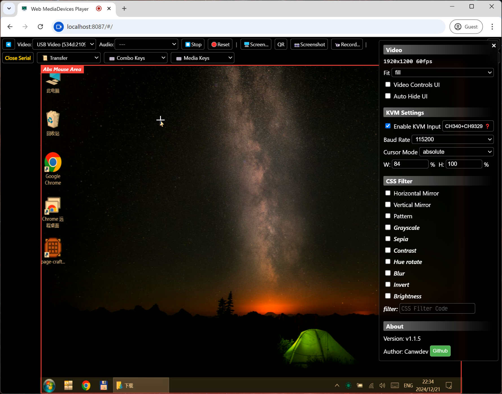
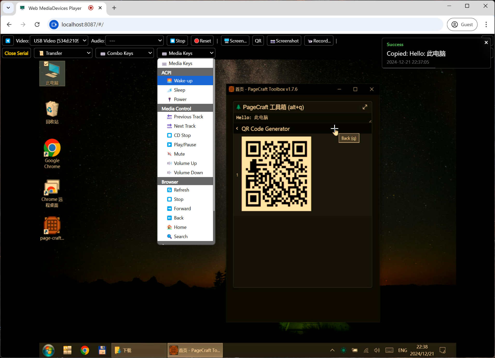
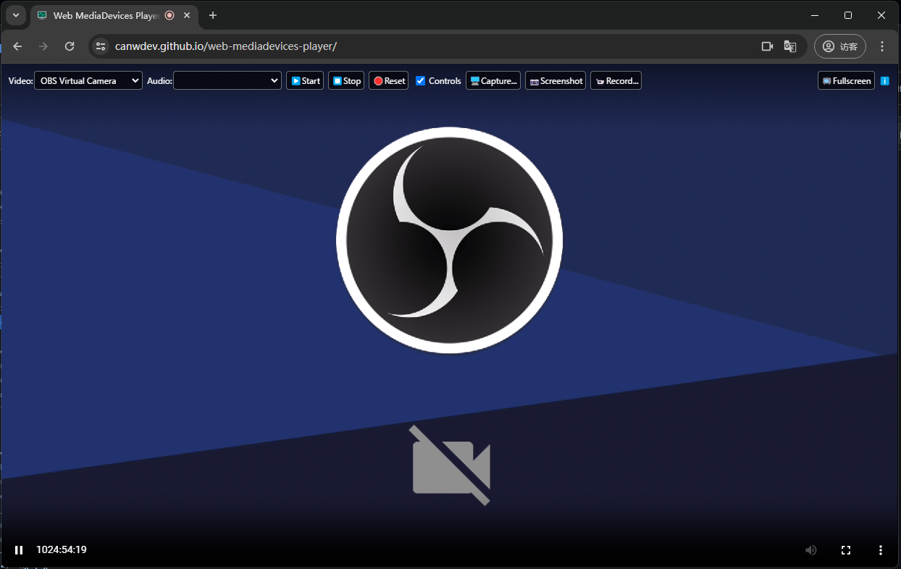

## Web MediaDevices Player

A web application for playing system [video/audio] input devices using the [Media Capture and Streams API](https://developer.mozilla.org/en-US/docs/Web/API/MediaDevices/getUserMedia) technology.

- Web version: https://canwdev.github.io/web-mediadevices-player/
- Tauri packaged client: [Releases](https://github.com/canwdev/web-mediadevices-player/releases)
- [Chinese Readme](./README.md)

Main purposes:
- View HDMI to USB capture card
- Play webcam videos, desktop screen recording
- Capture screenshots and record in webm format
- v1.1.5 New features
    - [CH9329](https://one-kvm.mofeng.run/ch9329_hid/) KVM keyboard and mouse control, ref: [webusbkvm](https://github.com/kkocdko/kblog/blob/master/source/toys/webusbkvm/README.md)
    - Supports relative mouse, absolute mouse, hotkeys, and ASCII text sending.
    - Video screen QR code scanning





Tips:
- The first time you use it, it will request camera and microphone permissions. You can reject microphone permissions if not needed. After requesting, it will wait a few seconds to load the devices.
- This page must run in https or localhost environments. Other environments (such as: filesystem) do not have access to devices.
- There may be issues with dragging the progress bar of the recorded webm video. Manually transcoding it to mp4 can solve the problem.

## Development

> Contributions are welcome

```sh
# Install dependencies
yarn install

# Development mode
yarn dev

# Build the Web version
yarn build

# Build Tauri App
yarn build:tauri
```

---

## Star History

- Thanks for your stars https://www.ruanyifeng.com/blog/2024/06/weekly-issue-303.html

[](https://star-history.com/#canwdev/web-mediadevices-player&Date)