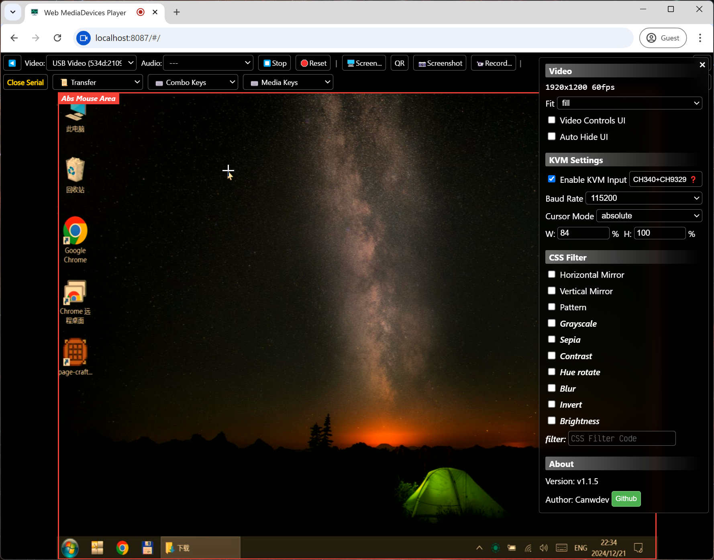
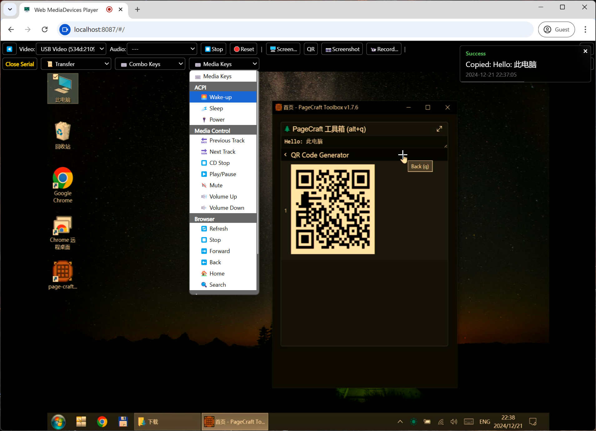
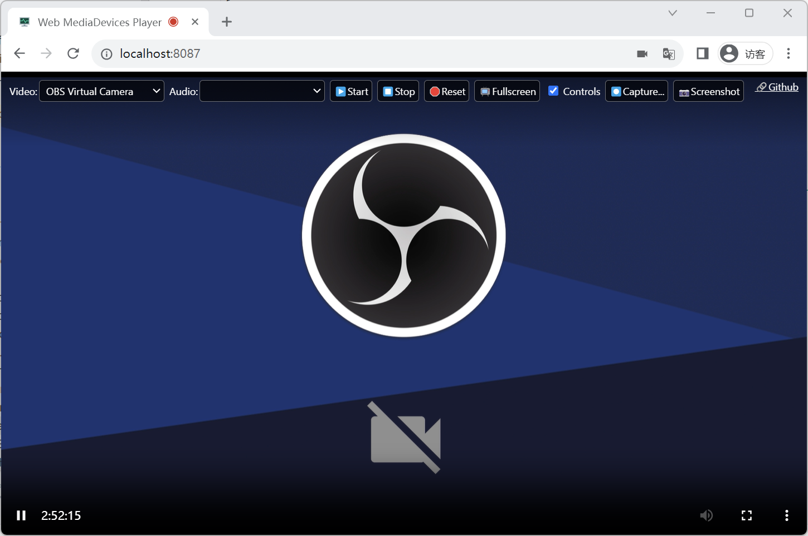

# Web MediaDevices Player

用于播放【视频/音频】输入设备的网页应用，使用了 [Media Capture and Streams API](https://developer.mozilla.org/en-US/docs/Web/API/MediaDevices/getUserMedia) 技术。

- 网页版：https://canwdev.github.io/web-mediadevices-player/
- Tauri 打包的客户端：[Releases](https://github.com/canwdev/web-mediadevices-player/releases)
- [English Readme](https://github.com/canwdev/web-mediadevices-player/tree/master?tab=readme-ov-file#english)

主要用途：
- HDMI to USB 采集卡查看
- Webcam 视频播放，桌面录屏
- 画面截图，录制为 webm 格式
- v1.1.5 新增功能
  - [CH9329](https://one-kvm.mofeng.run/ch9329_hid/) KVM 键鼠控制，参考: [webusbkvm](https://github.com/kkocdko/kblog/blob/master/source/toys/webusbkvm/README.md)
  - 支持相对鼠标、绝对鼠标、快捷键、ASCII文本发送
  - 视频画面二维码扫描





提示：
- 首次使用会请求摄像头和麦克风权限，如果不需要麦克风权限可以拒绝，请求过后会等待几秒钟加载设备。
- 此页面必须运行在 https 或 localhost 环境，其他环境（如：filesystem）无访问设备的权限。
- 录制的 webm 视频拖动进度条可能存在问题，手动转码成 mp4 即可解决。

---

## 开发

> 欢迎提交PR

```sh
# 安装依赖
yarn install

# 开发模式
yarn dev

# 构建 Web 版
yarn build

# 构建 Tauri App
yarn build:tauri
```

---

## English

A web application for playing system [video/audio] input devices using the [Media Capture and Streams API](https://developer.mozilla.org/en-US/docs/Web/API/MediaDevices/getUserMedia) technology.

- Web version: https://canwdev.github.io/web-mediadevices-player/
- Tauri packaged client: [Releases](https://github.com/canwdev/web-mediadevices-player/releases)

Main purposes:
- View HDMI to USB capture card
- Play webcam videos, desktop screen recording
- Capture screenshots and record in webm format
- v1.1.5 New features
  - [CH9329](https://one-kvm.mofeng.run/ch9329_hid/) KVM keyboard and mouse control, ref: [webusbkvm](https://github.com/kkocdko/kblog/blob/master/source/toys/webusbkvm/README.md)
  - Supports relative mouse, absolute mouse, hotkeys, and ASCII text sending.
  - Video screen QR code scanning


Tips:
- The first time you use it, it will request camera and microphone permissions. You can reject microphone permissions if not needed. After requesting, it will wait a few seconds to load the devices.
- This page must run in https or localhost environments. Other environments (such as: filesystem) do not have access to devices.
- There may be issues with dragging the progress bar of the recorded webm video. Manually transcoding it to mp4 can solve the problem.

## Development

> Contributions are welcome

```sh
# Install dependencies
yarn install

# Development mode
yarn dev

# Build the Web version
yarn build

# Build Tauri App
yarn build:tauri
```
