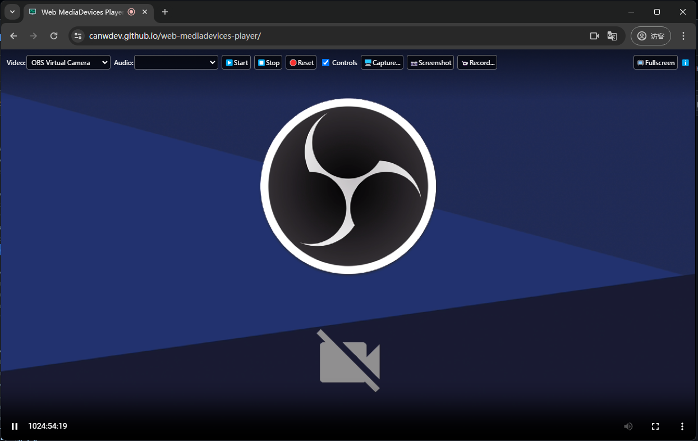

# Web MediaDevices Player

用于播放系统【视频/音频】输入设备的网页应用，使用了 [Media Capture and Streams API](https://developer.mozilla.org/en-US/docs/Web/API/MediaDevices/getUserMedia) 技术。

用途：
- HDMI to USB 采集卡投屏
- Webcam 视频播放
- 扩音器：Windows录音设备的“侦听”功能



提示：
- 现已支持 Tauri 打包的客户端！请到 [Releases](https://github.com/canwdev/web-mediadevices-player/releases) 页面下载
- 此页面必须运行在 https 或 localhost 环境，其他环境（如：filesystem）可能无法访问设备。

## Recommended IDE Setup

[VSCode](https://code.visualstudio.com/) + [Volar](https://marketplace.visualstudio.com/items?itemName=Vue.volar) (and disable Vetur) + [TypeScript Vue Plugin (Volar)](https://marketplace.visualstudio.com/items?itemName=Vue.vscode-typescript-vue-plugin).

## Customize configuration

See [Vite Configuration Reference](https://vitejs.dev/config/).

## Project Setup

```sh
npm install
```

### Compile and Hot-Reload for Development

```sh
npm run dev
```

### Compile and Minify for Production

```sh
npm run build
```

### Lint with [ESLint](https://eslint.org/)

```sh
npm run lint
```
